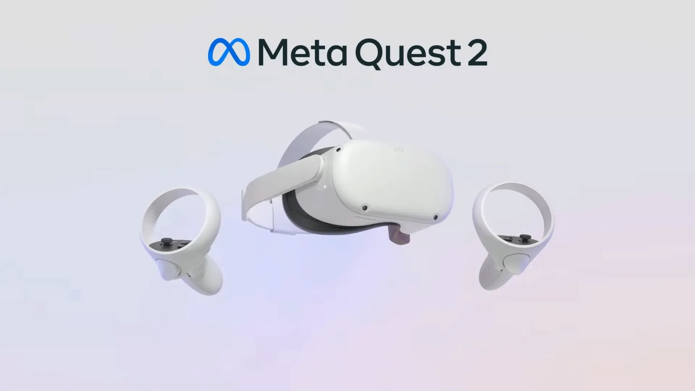
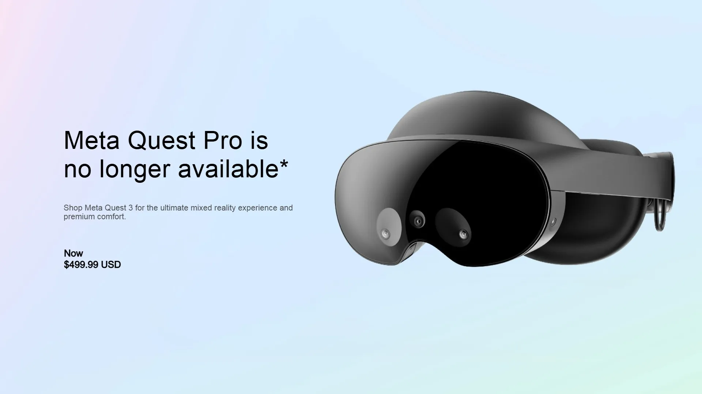

# Introduction

> ⚠️ **Device Model & Testing Disclaimer**  
> The findings, comparisons, and recommendations in this document are based on hands-on testing with specific VR headset models.  
> Research and observations were performed using the following devices:  
> - **Meta Quest 2 (512 GB)**  
> - **Meta Quest 3 (4K) (512 GB)**  
> - **Meta Quest Pro (256 GB)**  
>   
> Testing was conducted during **September 2025**, using the latest publicly available firmware at that time.  
> Performance, comfort, and immersion results may vary depending on firmware updates, storage capacity, and regional hardware variations.  
> Please note that the **Meta Quest Pro has since been discontinued**, which may limit its long-term support and availability.  
> All conclusions in this research should be interpreted with the understanding that they reflect the capabilities of these particular models *at the time of testing*.  

**Author:** Daniel Onyejiekwe   
**Date:** September 2025

This document provides a comparative analysis of VR headsets, focusing on Meta Quest 2, Meta Quest 3, and Meta Quest Pro. It explores their differences in immersion, performance, comfort, and user experience. The goal is to give developers, researchers, and enthusiasts a clear understanding of how each device measures up, helping guide purchasing decisions and optimize VR project development.

---

## 📌 Table of Contents  

  
1. Introduction

   - [Purpose of the Document](#purpose-of-the-document)  
   - [Scope of the Comparison](#scope-of-the-comparison)  

  
2. VR Headset Overview

   - [Meta Quest 2](#meta-quest-2)  
   - [Meta Quest 3](#meta-quest-3)  
   - [Meta Quest Pro](#meta-quest-pro)  

  
3. Hardware Specifications

   - [Display & Resolution](#display--resolution)  
   - [Processing Power & Graphics](#processing-power--graphics)  
   - [Tracking & Sensors](#tracking--sensors)  
   - [Controllers & Input Methods](#controllers--input-methods)  

  
4. Design & Comfort

   - [Weight & Ergonomics](#weight--ergonomics)  
   - [Strap & Padding](#strap--padding)  
   - [Lens Adjustability](#lens-adjustability)  

  
5. Immersion & Experience

   - [Field of View](#field-of-view)  
   - [Refresh Rate](#refresh-rate)  
   - [Passthrough & Mixed Reality](#passthrough--mixed-reality)  
   - [Audio & Haptics](#audio--haptics)  

  
6. Performance & Usability

   - [Setup & Ease of Use](#setup--ease-of-use)  
   - [Battery Life](#battery-life)  
   - [Software Ecosystem](#software-ecosystem)  
   - [Connectivity & Compatibility](#connectivity--compatibility)  

  
7. Use Cases

   - [Gaming & Entertainment](#gaming--entertainment)  
   - [Education & Training](#education--training)  
   - [Professional & Enterprise Applications](#professional--enterprise-applications)  

  
8. Comparative Analysis

   - [Strengths & Weaknesses](#strengths--weaknesses)  
   - [Price-to-Performance Ratio](#price-to-performance-ratio)  
   - [Best Use Scenarios](#best-use-scenarios)  

  

  
9–10. Conclusion, Recommendations & References

   - [Conclusion & Recommendations](#conclusion--recommendations)  
   - [References / Sources](#references--sources)  

  

---

## 📌 VR Headset Overview

A virtual reality (VR) headset is a wearable device that immerses users in a computer-generated environment by combining visual, auditory, and motion-tracking technologies. Most modern headsets include high-resolution displays, inside-out tracking cameras, and ergonomic controllers that allow for natural interaction. They are designed to deliver experiences ranging from gaming and entertainment to education, training, and professional applications. Differences between models often come down to factors like display quality, comfort, processing power, and price, which determine the overall level of immersion and usability.
---
### 📌 Meta Quest 2 
| Image | Video |
|---|---|
|  |  |

The Meta Quest 2, released in 2020, is a standalone VR headset designed for accessibility and affordability. It offers a sharp LCD display, inside-out tracking, and lightweight design, making it one of the most popular headsets for both newcomers and casual gamers. With a vast content library and no need for external sensors or a PC, it provides an easy entry point into VR, though its processing power and passthrough features are limited compared to newer models.

---
### 📌 Meta Quest 3 
| Image | Video |
|---|---|
|  |  |

Launched in 2023, the Meta Quest 3 builds on its predecessor with significant upgrades in display clarity, performance, and mixed reality capabilities. It features pancake lenses for slimmer optics, higher resolution, and improved color passthrough, allowing for more immersive VR and AR experiences. Powered by the Snapdragon XR2 Gen 2, it delivers faster performance and enhanced graphics while remaining wireless and user-friendly. The Quest 3 strikes a balance between affordability and cutting-edge features, appealing to both gamers and developers.

---
### 📌 Meta Quest Pro (Discontinued)
| Image | Video |
|---|---|
|  |  |

The Meta Quest Pro, introduced in 2022, is positioned as a high-end headset targeting professionals, creators, and enterprise users. It incorporates advanced features such as eye and face tracking, premium pancake lenses, higher-quality mixed reality passthrough, and a more ergonomic design with improved weight distribution. The Quest Pro emphasizes productivity and collaboration in VR/AR settings, with apps supporting design, remote work, and creative workflows. While more expensive, it offers a glimpse into the future of immersive computing beyond gaming.

---

## Hardware Specifications

### Display & Resolution 
| Feature | Meta Quest 2 | Meta Quest 3 | Meta Quest Pro |
|---------|--------------|--------------|----------------|
| Resolution per Eye | 1832 x 1920 pixels | 2064 x 2208 pixels | 1800 x 1920 pixels |
| Panel Type | LCD | LCD | LCD |
| Notes | uses single-panel LCD display | uses a dual LCD display | uses two LCD displays, one for each eye, with quantum dot technology and a local dimming backlight to enhance image quality and color. The headset also features next-generation pancake lenses, which contribute to a sharper and more uniformly in-focus image compared to previous models.  |

---

### Processing Power & Graphics 
| Feature | Meta Quest 2 | Meta Quest 3 | Meta Quest Pro |
|---------|--------------|--------------|----------------|
| Processor | Qualcomm Snapdragon XR2 | Qualcomm Snapdragon XR2 Gen 2 | Qualcomm Snapdragon XR2+ |
| RAM | 6GB of LPDDR4X RAM | 8 GB of LPDDR5 RAM | 12GB LPDDR5 RAM |
| GPU Features |  | Full-color passthrough for mixed reality applications. | The XR2+ processor is a more powerful version of the Snapdragon XR2 chip found in the Quest 2, delivering 50% more power. |

---

### Tracking & Sensors  
| Feature | Meta Quest 2 | Meta Quest 3 | Meta Quest Pro |
|---------|--------------|--------------|----------------|
| Cameras | 4 standard infrared tracking cameras, black-and-white passthrough. | 2 RGB color cameras for full-color passthrough and 2 infrared tracking cameras. A depth projector is also included. | 5 external high-resolution, full-color cameras and 5 internal cameras (including infrared) for eye and face tracking. |
| Extra Sensors | No extra internal sensors. | A depth sensor is used for more accurate mixed reality experiences, such as automatic room mapping. | Internal infrared sensors for eye and face tracking. |
| Notes | Head and hand tracking: Relies on external cameras for 6DoF tracking, including positional and rotational movement.  Hand tracking: Basic hand tracking is available, but overall movement tracking is less precise than later models.  Full-body tracking: Does not natively support full-body tracking. Requires third-party software and external hardware.  Passthrough: Low-resolution, grainy, black-and-white. | Upper-body tracking: Features "inside-out body tracking" that uses side cameras and AI to estimate upper-body and arm movements.  Full-body tracking: Combined with "generative legs" (AI-estimated motion) and third-party software, it can provide decent full-body emulation.  Advanced hand tracking: Uses a combination of cameras and machine learning for more responsive, gesture-based interactions.  Enhanced passthrough: High-resolution, full-color passthrough enables mixed-reality experiences. | Eye tracking: Inward-facing sensors track eye movement to make avatars more lifelike and to enable foveated rendering, which sharpens graphics where you look.  Face tracking: Sensors track your facial expressions, like mouth, cheek, and eyebrow movements, and replicate them on your avatar.  Self-tracking controllers: The Touch Pro controllers have their own built-in cameras and processor for independent tracking, providing a larger, more stable tracking range. |

---

### Controllers & Input Methods  
| Feature | Meta Quest 2 | Meta Quest 3 | Meta Quest Pro |
|---------|--------------|--------------|----------------|
| Controllers |  |  |  |
| Hand Tracking |  |  |  |
| Notes |  |  |  |

---

## Design & Comfort

### Weight & Ergonomics  
| Feature | Meta Quest 2 | Meta Quest 3 | Meta Quest Pro |
|---------|--------------|--------------|----------------|
| Weight | 503 grams (1.11 pounds) | 515 grams (1.13 pounds) | 722 grams (1.6 pounds) |
| Balance |  |  |  |

---

### Strap & Padding  
| Feature | Meta Quest 2 | Meta Quest 3 | Meta Quest Pro |
|---------|--------------|--------------|----------------|
| Strap Type |  |  |  |
| Comfort |  |  |  |

---

### Lens Adjustability  
| Feature | Meta Quest 2 | Meta Quest 3 | Meta Quest Pro |
|---------|--------------|--------------|----------------|
| IPD Adjustment |  |  |  |
| Method |  |  |  |

---

## Immersion & Experience

### Field of View  
| Feature | Meta Quest 2 | Meta Quest 3 | Meta Quest Pro |
|---------|--------------|--------------|----------------|
| Horizontal FOV | 90-100 degrees | 110 degrees | 106-108 degrees |
| Vertical FOV | 90-100 degrees | 96 degrees | 98 degrees |

---

### Refresh Rate  
| Feature | Meta Quest 2 | Meta Quest 3 | Meta Quest Pro |
|---------|--------------|--------------|----------------|
| Supported Rates | 60Hz, 72Hz, 80Hz, 90Hz, and 120Hz | 72Hz, 90Hz, and 120Hz | 72 Hz, and 90 Hz |

---

### Passthrough & Mixed Reality  
| Feature | Meta Quest 2 | Meta Quest 3 | Meta Quest Pro |
|---------|--------------|--------------|----------------|
| Passthrough Type |  |  |  |
| Quality |  |  |  |

---

### Audio & Haptics  
| Feature | Meta Quest 2 | Meta Quest 3 | Meta Quest Pro |
|---------|--------------|--------------|----------------|
| Audio |  |  |  |
| Haptics |  |  |  |

--- 

## Performance & Usability

### Setup & Ease of Use  
| Feature | Meta Quest 2 | Meta Quest 3 | Meta Quest Pro |
|---------|--------------|--------------|----------------|
| Setup |  |  |  |
| Notes |  |  |  |

---

### Battery Life  
| Feature | Meta Quest 2 | Meta Quest 3 | Meta Quest Pro |
|---------|--------------|--------------|----------------|
| Headset Battery | 3640 mAh | 4880 mAh | 4500 mAh |
| Controller Battery | 3000 mAh | 3000 mAh | **Uses rechargable battery, no published mAh amount bot reports state about 8 hours of battery life** |

---

### Software Ecosystem  
| Feature | Meta Quest 2 | Meta Quest 3 | Meta Quest Pro |
|---------|--------------|--------------|----------------|
| Store Access |  |  |  |
| Exclusive Features |  |  |  |

---

### Connectivity & Compatibility  
| Feature | Meta Quest 2 | Meta Quest 3 | Meta Quest Pro |
|---------|--------------|--------------|----------------|
| PC VR Support |  |  |  |
| Extras |  |  |  |

---

## Use Cases

### Gaming & Entertainment  
| Feature | Meta Quest 2 | Meta Quest 3 | Meta Quest Pro |
|---------|--------------|--------------|----------------|
| Gaming Experience |  |  |  |

---

### Education & Training  
| Feature | Meta Quest 2 | Meta Quest 3 | Meta Quest Pro |
|---------|--------------|--------------|----------------|
| Usefulness |  |  |  |

---

### Professional & Enterprise Applications  
| Feature | Meta Quest 2 | Meta Quest 3 | Meta Quest Pro |
|---------|--------------|--------------|----------------|
| Suitability |  |  |  |

---

## Comparative Analysis

### Strengths & Weaknesses  
| Device | Strengths | Weaknesses |
|--------|-----------|------------|
| Meta Quest 2 |  |  |
| Meta Quest 3 |  |  |
| Meta Quest Pro |  |  |

---

### Price-to-Performance Ratio  
| Device | Value Rating | Notes |
|--------|--------------|-------|
| Meta Quest 2 |  |  |
| Meta Quest 3 |  |  |
| Meta Quest Pro |  |  |

---

### Best Use Scenarios  
| Device | Best For | Notes |
|--------|----------|-------|
| Meta Quest 2 |  |  |
| Meta Quest 3 |  |  |
| Meta Quest Pro |  |  |

---

## 🧾 Conclusion & Recommendations

---

## References / Sources

---

## Personal Opinions & Notes  

This section reflects my own experiences and perspectives while testing the devices.  
These opinions are **subjective** and may differ for other users:  

- The **Meta Quest 2** still holds up well for its price, but the comfort is noticeably behind newer models.  
- The **Meta Quest 3** feels like the most balanced option in terms of performance, price, and future-proofing.  
- The **Meta Quest Pro**, while powerful, didn’t justify its price point for me — and its discontinuation confirms that.  
- In terms of immersion, the **Meta Quest 3** offered the best overall experience for gaming and productivity.  

> 📝 *These notes are intended as personal reflections and should not be taken as objective benchmarks.*  