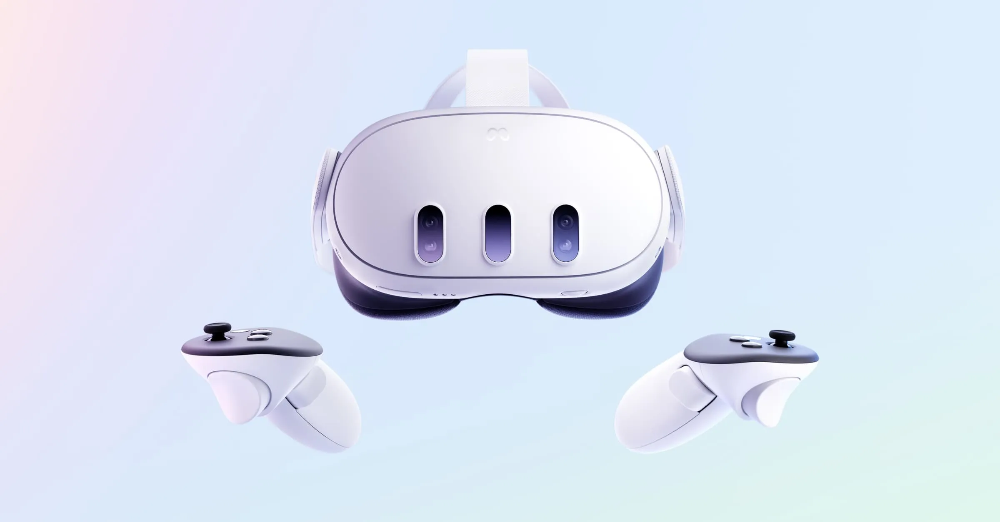

# Introduction

**Author:** Daniel Onyejiekwe   
**Date:** September 2025

This document provides a comparative analysis of VR headsets, focusing on Meta Quest 2, Meta Quest 3, and Meta Quest Pro. It explores their differences in immersion, performance, comfort, and user experience. The goal is to give developers, researchers, and enthusiasts a clear understanding of how each device measures up, helping guide purchasing decisions and optimize VR project development.

---

## 📌 Table of Contents  

1. [Introduction](#introduction)  
   - [Purpose of the Document](#purpose-of-the-document)  
   - [Scope of the Comparison](#scope-of-the-comparison)  

2. [VR Headset Overview](#vr-headset-overview)  
   - [Meta Quest 2](#meta-quest-2)  
   - [Meta Quest 3](#meta-quest-3)  
   - [Meta Quest Pro](#meta-quest-pro)  

3. [Hardware Specifications](#hardware-specifications)  
   - [Display & Resolution](#display--resolution)  
   - [Processing Power & Graphics](#processing-power--graphics)  
   - [Tracking & Sensors](#tracking--sensors)  
   - [Controllers & Input Methods](#controllers--input-methods)  

4. [Design & Comfort](#design--comfort)  
   - [Weight & Ergonomics](#weight--ergonomics)  
   - [Strap & Padding](#strap--padding)  
   - [Lens Adjustability](#lens-adjustability)  

5. [Immersion & Experience](#immersion--experience)  
   - [Field of View](#field-of-view)  
   - [Refresh Rate](#refresh-rate)  
   - [Passthrough & Mixed Reality](#passthrough--mixed-reality)  
   - [Audio & Haptics](#audio--haptics)  

6. [Performance & Usability](#performance--usability)  
   - [Setup & Ease of Use](#setup--ease-of-use)  
   - [Battery Life](#battery-life)  
   - [Software Ecosystem](#software-ecosystem)  
   - [Connectivity & Compatibility](#connectivity--compatibility)  

7. [Use Cases](#use-cases)  
   - [Gaming & Entertainment](#gaming--entertainment)  
   - [Education & Training](#education--training)  
   - [Professional & Enterprise Applications](#professional--enterprise-applications)  

8. [Comparative Analysis](#comparative-analysis)  
   - [Strengths & Weaknesses](#strengths--weaknesses)  
   - [Price-to-Performance Ratio](#price-to-performance-ratio)  
   - [Best Use Scenarios](#best-use-scenarios)  

9. [Conclusion & Recommendations](#conclusion--recommendations)  

10. [References / Sources](#references--sources)  

---

## 📌 VR Headset Overview

A virtual reality (VR) headset is a wearable device that immerses users in a computer-generated environment by combining visual, auditory, and motion-tracking technologies. Most modern headsets include high-resolution displays, inside-out tracking cameras, and ergonomic controllers that allow for natural interaction. They are designed to deliver experiences ranging from gaming and entertainment to education, training, and professional applications. Differences between models often come down to factors like display quality, comfort, processing power, and price, which determine the overall level of immersion and usability.

### 📌 Meta Quest 2 

The Meta Quest 2, released in 2020, is a standalone VR headset designed for accessibility and affordability. It offers a sharp LCD display, inside-out tracking, and lightweight design, making it one of the most popular headsets for both newcomers and casual gamers. With a vast content library and no need for external sensors or a PC, it provides an easy entry point into VR, though its processing power and passthrough features are limited compared to newer models.

### 📌 Meta Quest 3 

Launched in 2023, the Meta Quest 3 builds on its predecessor with significant upgrades in display clarity, performance, and mixed reality capabilities. It features pancake lenses for slimmer optics, higher resolution, and improved color passthrough, allowing for more immersive VR and AR experiences. Powered by the Snapdragon XR2 Gen 2, it delivers faster performance and enhanced graphics while remaining wireless and user-friendly. The Quest 3 strikes a balance between affordability and cutting-edge features, appealing to both gamers and developers.

### 📌 Meta Quest Pro (Discontinued)

The Meta Quest Pro, introduced in 2022, is positioned as a high-end headset targeting professionals, creators, and enterprise users. It incorporates advanced features such as eye and face tracking, premium pancake lenses, higher-quality mixed reality passthrough, and a more ergonomic design with improved weight distribution. The Quest Pro emphasizes productivity and collaboration in VR/AR settings, with apps supporting design, remote work, and creative workflows. While more expensive, it offers a glimpse into the future of immersive computing beyond gaming.

---

## Hardware Specifications

### Display & Resolution 
### Processing Power & Graphics 
### Tracking & Sensors
### Controllers & Input Methods

---

## Design & Comfort

### Weight & Ergonomics 
### Strap & Padding 
### Lens Adjustability

---

## Immersion & Experience

### Field of View
### Refresh Rate 
### Passthrough & Mixed Reality 
### Audio & Haptics 

---

## Performance & Usability

### Setup & Ease of Use 
### Battery Life 
### Software Ecosystem 
### Connectivity & Compatibility

---

## Use Cases

### Gaming & Entertainment
### Education & Training 
### Professional & Enterprise Applications

---

## Comparative Analysis

### Strengths & Weaknesses
### Price-to-Performance Ratio  
### Best Use Scenarios

---

## 🧾 Conclusion & Recommendations

---

## References / Sources